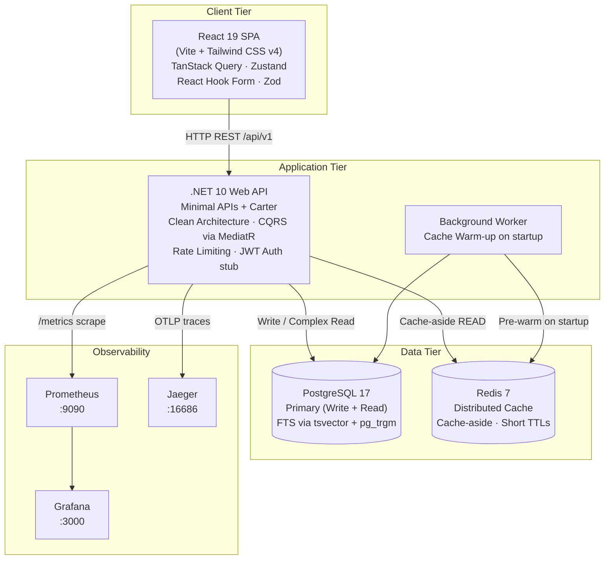
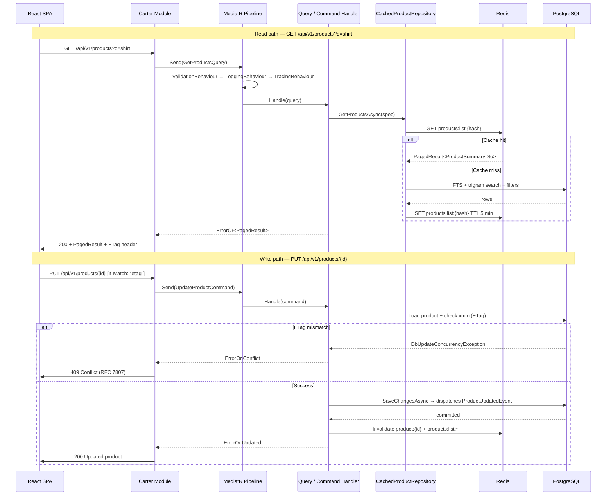
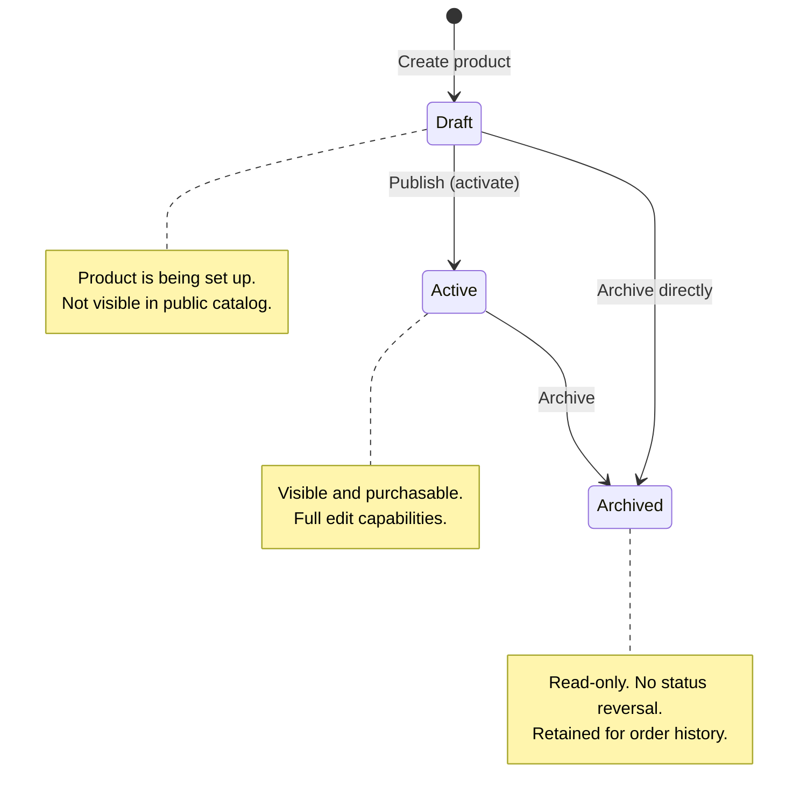
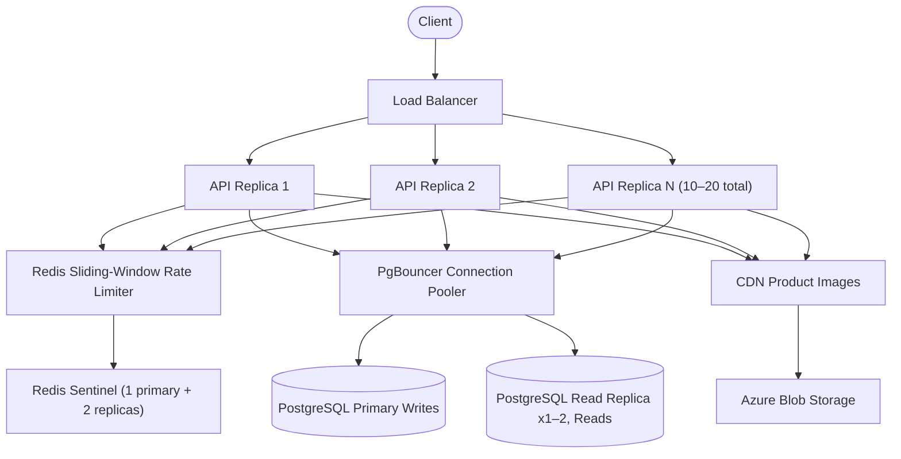
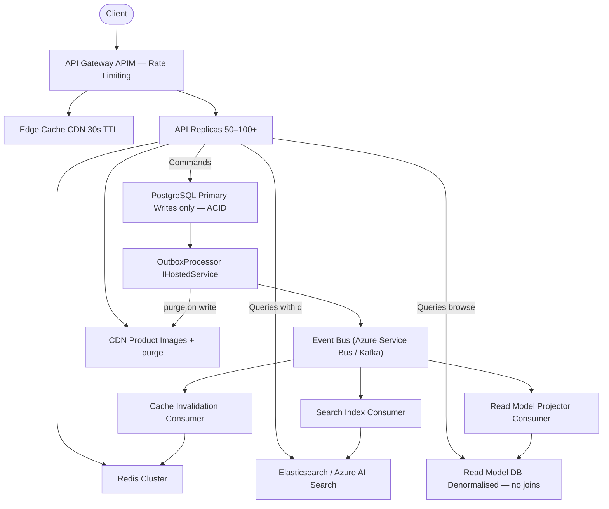

# E-Commerce Product Management

A production-grade product management system for retail/e-commerce applications. Built with **.NET 10**, **PostgreSQL**, **Redis**, **React 19**, and **TypeScript**.

## Architecture



### Data Flow



## Tech Stack

| Layer | Technology | Purpose |
|-------|-----------|---------|
| Backend | .NET 10 + ASP.NET Core | Web API with Carter minimal APIs |
| Architecture | Clean Architecture + CQRS | Domain separation + MediatR command/query |
| Database | PostgreSQL 17 + EF Core | Relational storage + full-text search (trigram) |
| Cache | Redis 7 + StackExchange.Redis | Distributed caching with exponential backoff |
| Validation | FluentValidation 11 | Request validation pipeline |
| Logging | Serilog 10 | Structured JSON logging |
| API Docs | Scalar (OpenAPI) | Interactive API explorer |
| Tracing | OpenTelemetry + Jaeger | Distributed request tracing |
| Metrics | Prometheus + Grafana | Application metrics dashboards |
| Frontend | React 19 + TypeScript 5 | Component-based UI |
| Build | Vite 7 | Fast frontend build and HMR |
| Routing | React Router 7 | Client-side navigation |
| Server State | TanStack React Query 5 | Data fetching, caching, mutations |
| Client State | Zustand 5 | UI state (filters, search) |
| Forms | React Hook Form 7 + Zod 4 | Schema-validated form management |
| HTTP Client | Axios 1 | RFC 7807 error normalization |
| UI / Styling | Tailwind CSS 4 | Utility-first styling |
| Tables | TanStack React Table 8 | Sortable, paginated data tables |

## Getting Started

### Prerequisites

- **Docker + Docker Compose** (recommended)
- **Node.js 22 LTS** + **pnpm** (for frontend-only dev)
- **.NET 10 SDK** (for backend-only dev)

### Option A: Docker Compose (Full Stack)

Start all services with one command:

```bash
cp .env.example .env
docker compose up -d
```

Access the apps:

| Service | URL | Description |
|---------|-----|-------------|
| `frontend` | http://localhost:5173 | React product management UI |
| `api` | http://localhost:5001 | ASP.NET Core REST API |
| `api-docs` | http://localhost:5001/scalar/v1 | Interactive API explorer (Scalar) |
| `prometheus` | http://localhost:9090 | Metrics scraper |
| `grafana` | http://localhost:3000 | Metrics dashboard (admin / admin) |
| `jaeger` | http://localhost:16686 | Distributed tracing UI |
| `postgres` | localhost:5432 | PostgreSQL database |
| `redis` | localhost:6379 | Redis cache |

Stop all services:

```bash
docker compose down
```

### Option B: Local Development

**Terminal 1 — Infrastructure (PostgreSQL + Redis)**

```bash
docker compose up -d postgres redis
```

**Terminal 2 — Backend API**

```bash
cd src/ProductManagement.API
dotnet run
# API available at http://localhost:5066
```

**Terminal 3 — Frontend**

```bash
cd frontend
pnpm install
pnpm dev
# UI available at http://localhost:5173
```

### Option C: Observability Stack

Run the full observability stack alongside development:

```bash
docker compose up -d postgres redis prometheus grafana jaeger
```

Then set the OTLP endpoint in your local `appsettings.Development.json`:

```json
{
  "OpenTelemetry": {
    "Endpoint": "http://localhost:4317"
  }
}
```

## Project Structure

```
e-comerce-product-management/
├── docker-compose.yml               # Full stack orchestration
├── .env.example                     # Environment variable template
├── ProductManagement.slnx           # .NET solution file
│
├── src/
│   ├── ProductManagement.API/       # ASP.NET Core Web API
│   │   ├── Program.cs               # App bootstrap + DI registration
│   │   ├── Modules/                 # Carter API modules (minimal API)
│   │   │   ├── ProductModule.cs     # Product CRUD + search endpoints
│   │   │   ├── CategoryModule.cs    # Category CRUD endpoints
│   │   │   └── VariantModule.cs     # Variant management endpoints
│   │   ├── Middleware/
│   │   │   ├── GlobalExceptionHandler.cs
│   │   │   └── CorrelationIdMiddleware.cs
│   │   └── appsettings.json
│   │
│   ├── ProductManagement.Application/  # Business logic
│   │   ├── Commands/                # Write operations (Create, Update, Delete)
│   │   ├── Queries/                 # Read operations (GetProducts, GetById)
│   │   ├── Behaviours/              # MediatR pipeline (Logging, Validation, Tracing)
│   │   ├── DTOs/                    # Data transfer objects
│   │   └── Services/                # SlugService
│   │
│   ├── ProductManagement.Domain/    # Core domain
│   │   ├── Entities/
│   │   │   ├── Product.cs           # Aggregate root
│   │   │   ├── ProductVariant.cs
│   │   │   ├── ProductImage.cs
│   │   │   ├── Category.cs
│   │   │   └── OutboxMessage.cs     # Outbox pattern for events
│   │   ├── ValueObjects/
│   │   │   ├── Money.cs
│   │   │   └── Slug.cs
│   │   └── Enums/
│   │       └── ProductStatus.cs     # Draft / Active / Archived
│   │
│   └── ProductManagement.Infrastructure/  # External concerns
│       ├── Persistence/
│       │   ├── ProductManagementDbContext.cs
│       │   ├── Configurations/      # EF Core entity configurations
│       │   ├── Migrations/          # EF Core database migrations
│       │   └── Repositories/        # IProductRepository, ICategoryRepository
│       ├── Caching/
│       │   └── RedisCacheService.cs
│       └── BackgroundServices/
│           └── ProductCacheWarmingService.cs
│
├── frontend/
│   ├── Dockerfile                   # Multi-stage (dev + production/nginx)
│   ├── vite.config.ts
│   ├── tsconfig.json
│   └── src/
│       ├── api/
│       │   ├── client.ts            # Axios instance + error normalization
│       │   ├── products.ts          # Product API calls + ETag handling
│       │   └── categories.ts        # Category API calls
│       ├── features/
│       │   └── products/
│       │       ├── components/      # ProductTable, ProductForm, FilterPanel
│       │       └── hooks/           # useProducts, useProductMutations
│       ├── pages/
│       │   └── products/            # List, New, Detail, Edit pages
│       ├── components/ui/           # Button, Input, Select, Modal, Toast
│       ├── layouts/                 # AppLayout, Header, Sidebar
│       ├── lib/
│       │   ├── schemas.ts           # Zod validation schemas
│       │   ├── queryClient.ts       # TanStack Query config
│       │   └── hooks/
│       │       └── useDebounce.ts
│       └── types/                   # TypeScript interfaces + DTOs
│
├── infra/
│   ├── prometheus/                  # prometheus.yml scrape config
│   └── grafana/                     # Dashboard provisioning
│
├── tests/                           # Unit + integration tests (.NET)
│
├── docs/
│   ├── adr/                         # Architecture Decision Records (ADR-01 … ADR-13)
│   └── ai/                          # AI-assisted requirements, design, planning
│
└── .github/
    └── workflows/
        ├── backend.yml              # .NET build, test, docker validate
        └── frontend.yml             # Type-check, lint, build, docker validate
```
---

## Environment Variables

### Backend (`src/ProductManagement.API`)

| Variable | Default | Description |
|----------|---------|-------------|
| `ASPNETCORE_ENVIRONMENT` | `Development` | Environment name |
| `ConnectionStrings__DefaultConnection` | — | PostgreSQL connection string |
| `ConnectionStrings__Redis` | — | Redis connection string |
| `Cors__AllowedOrigins` | _(empty)_ | Comma-separated allowed origins |
| `RateLimit__WriteOperationsPerMinute` | `1000` | Max write requests per minute |
| `Auth__Enabled` | `false` | Enable/disable JWT authentication |
| `Auth__Authority` | — | OAuth2 authority URL |
| `Auth__Audience` | — | JWT audience claim |
| `OpenTelemetry__ServiceName` | `product-management-api` | OTLP service name |
| `OpenTelemetry__Endpoint` | — | OTLP collector endpoint |
| `Search__TrigramThreshold` | `0.3` | PostgreSQL trigram similarity threshold |

### Frontend (`frontend/`)

| Variable | Default | Description |
|----------|---------|-------------|
| `VITE_API_BASE_URL` | `http://localhost:5001` | Backend REST API base URL |

### Docker Compose (`.env`)

| Variable | Default | Description |
|----------|---------|-------------|
| `POSTGRES_USER` | `productmgmt` | PostgreSQL username |
| `POSTGRES_PASSWORD` | `productmgmt_dev` | PostgreSQL password |
| `POSTGRES_DB` | `productmanagement` | PostgreSQL database name |
| `POSTGRES_PORT` | `5432` | PostgreSQL host port |
| `REDIS_PASSWORD` | `redis_dev` | Redis AUTH password |
| `REDIS_PORT` | `6379` | Redis host port |
| `API_PORT` | `5001` | API host port |
| `GRAFANA_ADMIN_PASSWORD` | `admin` | Grafana admin password |
| `JAEGER_UI_PORT` | `16686` | Jaeger UI host port |
| `OTEL_EXPORTER_OTLP_ENDPOINT` | `http://jaeger:4317` | OTLP endpoint (inside Docker network) |


--- 

## API Documentation

Interactive documentation is available via Scalar at `/scalar/v1` when the API is running.

### Products

#### `GET /api/v1/products`

Returns a paginated, filterable list of products.

**Query parameters:**

| Parameter | Type | Default | Description |
|-----------|------|---------|-------------|
| `page` | integer | 1 | Page number |
| `pageSize` | integer | 20 | Items per page (max 100) |
| `q` | string | — | Full-text search (name, description) |
| `categoryId` | guid | — | Filter by category |
| `status` | string | — | Filter by status: `Draft`, `Active`, `Archived` |
| `minPrice` | decimal | — | Minimum base price filter |
| `maxPrice` | decimal | — | Maximum base price filter |
| `sizes[]` | string[] | — | Filter by available sizes |
| `colors[]` | string[] | — | Filter by available colors |
| `sortBy` | string | `name` | Sort field |
| `sortDescending` | boolean | false | Reverse sort order |

**Response:**
```json
{
  "items": [
    {
      "id": "3fa85f64-5717-4562-b3fc-2c963f66afa6",
      "name": "Classic White T-Shirt",
      "slug": "classic-white-t-shirt",
      "brand": "BrandName",
      "basePrice": 29.99,
      "currency": "USD",
      "status": "Active",
      "categoryId": "...",
      "categoryName": "Tops",
      "primaryImageUrl": "https://...",
      "createdAt": "2024-01-15T10:30:00Z"
    }
  ],
  "totalCount": 142,
  "page": 1,
  "pageSize": 20,
  "totalPages": 8
}
```

#### `GET /api/v1/products/{id}`

Returns full product details including variants and images. Includes an `ETag` response header for optimistic concurrency control.

**Response headers:**
```
ETag: "\"abc123\""
```

**Response:**
```json
{
  "id": "3fa85f64-5717-4562-b3fc-2c963f66afa6",
  "name": "Classic White T-Shirt",
  "slug": "classic-white-t-shirt",
  "brand": "BrandName",
  "description": "A comfortable everyday t-shirt.",
  "basePrice": 29.99,
  "currency": "USD",
  "status": "Active",
  "attributes": { "material": "cotton", "fit": "regular" },
  "category": { "id": "...", "name": "Tops" },
  "variants": [
    {
      "id": "...",
      "sku": "CWT-S-WHT",
      "size": "S",
      "color": "White",
      "price": 29.99,
      "stockQuantity": 50
    }
  ],
  "images": [
    { "id": "...", "url": "https://...", "altText": "Front view", "isPrimary": true }
  ],
  "createdAt": "2024-01-15T10:30:00Z",
  "updatedAt": "2024-01-20T08:00:00Z"
}
```

#### `POST /api/v1/products`

Creates a new product. Requires authentication (when enabled).

**Request body:**
```json
{
  "name": "Classic White T-Shirt",
  "brand": "BrandName",
  "description": "A comfortable everyday t-shirt.",
  "basePrice": 29.99,
  "currency": "USD",
  "categoryId": "3fa85f64-5717-4562-b3fc-2c963f66afa6",
  "attributes": { "material": "cotton" }
}
```

#### `PUT /api/v1/products/{id}`

Full update of a product. Requires the `If-Match` header with the current ETag to prevent concurrent overwrites.

**Request headers:**
```
If-Match: "\"abc123\""
```

**Error responses:**

| Status | Description |
|--------|-------------|
| `412` | ETag mismatch — another client modified the resource |
| `404` | Product not found |
| `422` | Validation failed |

#### `PATCH /api/v1/products/{id}/status`

Transitions a product through its status lifecycle.

**Valid transitions:**

| From | To |
|------|----|
| `Draft` | `Active` |
| `Active` | `Archived` |

**Request body:**
```json
{ "status": "Active" }
```

#### `DELETE /api/v1/products/{id}`

Soft deletes a product (marks as deleted, not physically removed).

### Categories

#### `GET /api/v1/categories`

Returns all categories.

#### `POST /api/v1/categories`

Creates a new category.

**Request body:**
```json
{ "name": "Tops", "description": "Upper body clothing" }
```

### Health Checks

#### `GET /health`

Returns liveness/readiness status for orchestration probes.

**Response:**
```json
{
  "status": "Healthy",
  "checks": {
    "database": "Healthy",
    "redis": "Healthy"
  }
}
```

## Database Schema

### `products` Table

| Column | Type | Required | Constraints | Description |
|--------|------|----------|-------------|-------------|
| `id` | uuid | yes | Primary key | Product identifier |
| `name` | varchar(200) | yes | — | Display name |
| `slug` | varchar(220) | yes | Unique | URL-friendly name |
| `brand` | varchar(100) | yes | — | Brand name |
| `description` | text | no | — | Full product description |
| `base_price` | numeric(18,2) | yes | >= 0 | Base selling price |
| `currency` | varchar(3) | yes | Default: USD | ISO 4217 code |
| `status` | varchar(20) | yes | Enum | Draft / Active / Archived |
| `category_id` | uuid | no | FK categories | Product category |
| `attributes` | jsonb | no | — | Flexible key-value attributes |
| `search_vector` | tsvector | auto | — | PostgreSQL full-text search vector |
| `is_deleted` | boolean | yes | Default: false | Soft delete flag |
| `created_at` | timestamptz | yes | — | Record creation time |
| `updated_at` | timestamptz | yes | — | Last modification time |

### `product_variants` Table

| Column | Type | Required | Description |
|--------|------|----------|-------------|
| `id` | uuid | yes | Variant identifier |
| `product_id` | uuid | yes | Parent product FK |
| `sku` | varchar(100) | yes | Stock-keeping unit (unique) |
| `size` | varchar(50) | no | Size label |
| `color` | varchar(50) | no | Color name |
| `price` | numeric(18,2) | yes | Variant-specific price |
| `stock_quantity` | integer | yes | Available stock |

### `categories` Table

| Column | Type | Required | Description |
|--------|------|----------|-------------|
| `id` | uuid | yes | Category identifier |
| `name` | varchar(100) | yes | Display name |
| `description` | text | no | Category description |

### Indexes

| Index | Type | Purpose |
|-------|------|---------|
| `{ product_id, timestamp DESC }` | Compound | Efficient variant lookups |
| `search_vector` | GIN | Full-text search on name/description |
| `{ category_id }` | B-tree | Filter products by category |
| `{ status }` | B-tree | Filter by product status |
| `{ slug }` | Unique B-tree | Slug uniqueness enforcement |
| `{ sku }` | Unique B-tree | SKU uniqueness across variants |

## Product Status Lifecycle



## Caching Strategy

Redis caching is applied at the query layer with the prefix `pm:`.

| Cache Key Pattern | TTL | Invalidated On |
|-------------------|-----|----------------|
| `pm:products:list:*` | 5 min | Create / Update / Delete / Status change |
| `pm:products:detail:{id}` | 10 min | Update / Delete that product |
| `pm:categories:list` | 30 min | Create / Update category |

**Cache Warming** — On startup, `ProductCacheWarmingService` pre-loads the most-accessed products into Redis to eliminate cold-start latency.

**Redis Connection** — Uses exponential backoff retry policy. If Redis is unavailable, the application falls back to direct database reads.

## Concurrency Control

Product updates use optimistic concurrency via HTTP ETags:

1. `GET /api/v1/products/{id}` — response includes `ETag: "\"v1\""` header
2. Client stores the ETag
3. `PUT /api/v1/products/{id}` — client sends `If-Match: "\"v1\""` header
4. API checks the stored ETag against the current version
5. If mismatch → `412 Precondition Failed` (another writer updated first)
6. If match → apply update, issue new ETag

This prevents the _lost update_ problem in multi-user environments without pessimistic database locks.

## Observability

The application ships with a fully integrated observability stack.

### Distributed Tracing (Jaeger)

Every request is automatically traced with OpenTelemetry. Traces include:
- Inbound HTTP request span
- MediatR command/query spans (via `TracingBehaviour`)
- Database query spans (EF Core instrumentation)
- Redis operation spans

Access traces at **http://localhost:16686** (Jaeger UI).

### Metrics (Prometheus + Grafana)

Prometheus scrapes the `/metrics` endpoint. Key metrics:

| Metric | Type | Description |
|--------|------|-------------|
| `http_requests_total` | Counter | Request count by method, path, status |
| `http_request_duration_seconds` | Histogram | Request latency distribution |
| `db_query_duration_seconds` | Histogram | Database query timing |
| `cache_hits_total` | Counter | Redis cache hit count |
| `cache_misses_total` | Counter | Redis cache miss count |

Access dashboards at **http://localhost:3000** (Grafana, admin / admin).

### Structured Logging (Serilog)

All logs are emitted as structured JSON with:
- `CorrelationId` — propagated per-request via `X-Correlation-ID` header
- `RequestPath`, `StatusCode`, `Elapsed` on every response
- `CommandName`, `QueryName` on application layer operations

## Scaling Architecture

### Scale 10x



| Change | Trigger | Code impact |
|--------|---------|-------------|
| 10–20 API replicas | CPU > 60% or P99 latency rising | None — business logic and handlers are already stateless |
| Redis sliding-window rate limiter | More than one API replica running | `Program.cs` registration swap only; `RateLimit:WriteRequestsPerMinute` config unchanged |
| PostgreSQL read replica (1–2) | Primary CPU > 60% or read P99 > 100 ms | Register second `DbContextOptions` for `ConnectionStrings:ReadConnection`; route `IReadDbContext` there — no handler changes |
| PgBouncer connection pooler | `replicas × pool_size` approaches `max_connections` | Connection string change only; EF Core is unaware of the proxy |
| Redis Sentinel / cache-gen token | Single Redis node is SPOF or nears memory ceiling | Connection string + replace prefix-scan invalidation with `INCR pm:products:gen` counter |
| CDN activation for images | Image bandwidth cost or P99 > 200 ms | None — `ProductImage.CdnUrl` column already exists; configure CDN to front Blob Storage |

> **No domain logic, application use cases, or handler contracts change at 10x.** Only infrastructure wiring (`DependencyInjection.cs`, `Program.cs`, connection strings) is touched.

### Scale 100x



| Change | Trigger | Code impact |
|--------|---------|-------------|
| Async write path + OutboxProcessor | Write P99 > 300 ms or sustained write RPS > 5,000 | Activate `OutboxProcessor` `IHostedService` (polls `outbox_messages WHERE processed_at IS NULL`); write endpoints return `202 Accepted`; `outbox_messages` table already in the initial migration |
| Dedicated search service | FTS query P99 > 80 ms or catalogue > 5M products | `GetProductsQueryHandler` delegates `q`-bearing requests to Elasticsearch / Azure AI Search client; `OutboxProcessor` maintains the index asynchronously; no change to write handlers |
| Denormalised read model DB | Read replica lag > 1 s under write surge | `GetProductsQueryHandler` and `GetProductByIdQueryHandler` receive `IProductReadRepository` backed by the read model; `IProductRepository` (write side) unchanged; `OutboxProcessor` upserts the projection |
| API Gateway rate limiting + edge cache | 50+ replicas make in-process limiting impractical; product detail P99 needs < 20 ms | Remove `UseRateLimiter()` from application; move policy to APIM / CloudFront; `ETag` header already emitted — gateway honours `If-None-Match` for `304` responses |
| PostgreSQL table partitioning by `status` | `products` table > 20M rows, VACUUM > 10 min | Migration only — EF Core and Npgsql are transparent to partitioned tables; no application code changes |
| Microservices split | Independent teams blocked by shared deployment | Prerequisite: event bus (OutboxProcessor) must be in place first; internal design of each service stays identical (Clean Architecture, MediatR, EF Core) |

> The `outbox_messages` table, CQRS command/query split, and `ProductCacheInvalidationHandler` event pattern are not throwaway — they are the exact seams along which every 100x change is introduced without rewriting domain or application logic.

--- 

## Technical Considerations

```
1x (current)            10x                          100x
─────────────           ─────────────                ─────────────
Single PostgreSQL    →  Primary + read replicas   →  Primary + denormalised read model DB
                        PgBouncer

In-process FTS       →  (unchanged)               →  Dedicated search service
                                                      (Elasticsearch / Azure AI Search)

Sync write path      →  (unchanged)               →  Async via OutboxProcessor + event bus
                                                      (202 Accepted)

In-process           →  Redis sliding-window       →  API Gateway (APIM / CloudFront)
rate limiter            limiter                       global enforcement

Single Redis node    →  Redis Sentinel / Cluster   →  (unchanged from 10x)

2–3 API replicas     →  10–20 replicas             →  50–100+ replicas + edge cache deflection
```